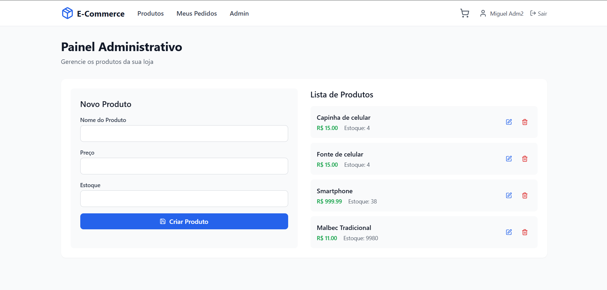
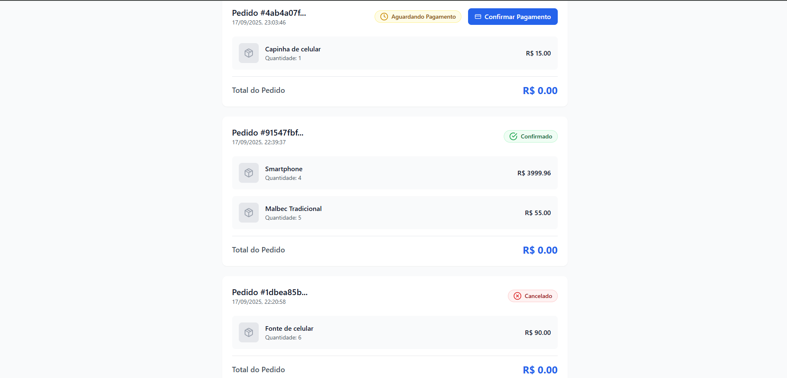
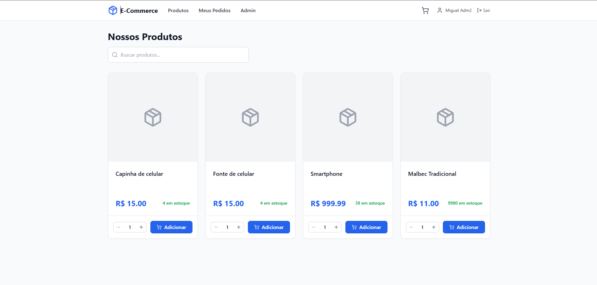
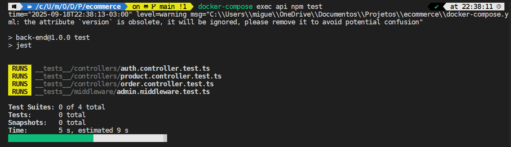

# Projeto E-commerce Completo (API & Client)


Este é um projeto full-stack de e-commerce que simula um ambiente de loja virtual completo, desde a listagem de produtos até a criação e acompanhamento de pedidos com um fluxo de pagamento assíncrono.

## Demonstração(Principais Páginas)
Aqui você pode ver uma prévia de como a aplicação funciona.
### Painel Admin

### Página Meus Pedidos(Com Status da compra com Redis (Docker))

### Página de Produtos

### Console Jest Tests(Testes no Auth)


## Tech Stack

#### **Backend**
- **Linguagem:** TypeScript
- **Framework:** Node.js com Express.js
- **Banco de Dados:** PostgreSQL (via Docker)
- **Mensageria/Cache:** Redis (via Docker)
- **ORM:** Prisma
- **Autenticação:** JWT (JSON Web Tokens) e bcrypt.js
- **Testes:** **Jest**, **Supertest** e **jest-mock-extended**
- **Infraestrutura:** Docker Compose
- **Ferramentas de Desenvolvimento:** `ts-node-dev`, `concurrently`

# Como Rodar o Projeto

Este projeto é totalmente containerizado com Docker Compose. Para rodar, você precisa ter o [Docker](https://www.docker.com/) e o [Node.js](https://nodejs.org/en/) instalados.

**1. Clone e Configure o Ambiente**

Primeiro, clone o repositório, navegue até a pasta e crie o arquivo de ambiente a partir do exemplo.

```bash
# Clone o projeto
git clone <URL_DO_SEU_REPOSITORIO>
cd ecommerce

# Crie o arquivo .env na raiz a partir do exemplo do back-end
cp back-end/.env.example .env
```
**Importante:** Abra o arquivo .env e defina sua JWT_SECRET. As outras variáveis já estão configuradas para o ambiente Docker.

**2. Execute os Serviços**
Com o .env pronto, o processo é dividido em três ações principais, que você pode executar em terminais separados.

🖥️ Terminal 1 (Raiz do Projeto): Subir o Back-end
```bash
# Constrói as imagens (na primeira vez) e inicia a API, DB e Redis
docker-compose up --build
```
*Deixe este terminal rodando.*

🖥️ Terminal 2 (Raiz do Projeto): Preparar o Banco de Dados
```bash
# Em um novo terminal, execute a migration e o seed
docker-compose exec api npx prisma migrate dev && docker-compose exec api npx prisma db seed
```
*> Após este comando, o banco estará pronto com dados de teste, incluindo um usuário admin (admin@ecommerce.com / admin123).*

🖥️ Terminal 3 (Pasta front-end): Iniciar o Front-end
```bash
# Em um novo terminal, inicie a aplicação React
cd front-end
npm install
npm run dev
```
Pronto! A aplicação estará disponível em http://localhost:5173.

## Testes

A API do back-end possui uma suíte de testes robusta utilizando **Jest** para garantir a qualidade e a estabilidade do código.

### Estratégia de Testes
A estratégia adotada combina dois tipos de testes:
- **Testes Unitários:** Focados em validar as menores unidades de código de forma isolada, como middlewares. Isso garante que a lógica interna de cada função se comporte como o esperado.
- **Testes de Integração:** Focados em validar a interação entre as diferentes partes da API (rotas, controllers, middlewares e serviços). Estes testes simulam requisições HTTP reais e verificam se o sistema como um todo responde corretamente, utilizando mocks para isolar dependências externas como o banco de dados e o Redis.

### Como Rodar os Testes
Com o ambiente Docker em execução (`docker-compose up`), os testes podem ser executados dentro do contêiner da API.

```bash
# Na raiz do projeto, execute todos os testes de uma vez
docker-compose exec api npm test

# 2. Rode todos os testes de uma vez
npm test

# OU, para rodar um arquivo de teste específico:
docker-compose exec api npx jest __tests__/controllers/auth.controller.test.ts
```

## Funcionalidades

- **Autenticação de Usuários:** 
    - Cadastro e Login com JWT.
    - Validação de formato para CPF/CNPJ no registro para garantir a integridade dos dados.
- **Gestão de Produtos:** Admins podem criar e atualizar produtos.
- **Listagem de Produtos:** Página pública para visualização e busca de produtos.
- **Carrinho de Compras:** Contexto completo para adicionar, remover e atualizar itens.
- **Checkout:** Finalização de compra integrada com o usuário logado.
- **Meus Pedidos:** Página para o usuário visualizar o histórico e o status de seus pedidos.
- **Processamento Assíncrono:** Uso de Redis para simular um fluxo de pagamento e atualização de estoque que não trava a experiência do usuário.

## Funcionalidades de Bônus Implementadas

Além dos requisitos principais, o projeto implementa várias funcionalidades de bônus que aumentam sua robustez e profissionalismo:

- **⭐ Infraestrutura com Docker Compose:** Todo o ambiente de back-end, incluindo a API, o banco de dados PostgreSQL e o Redis, é orquestrado com um único arquivo `docker-compose.yml`, garantindo um setup de desenvolvimento rápido, consistente e isolado.
- **⭐ Permissões Diferenciadas:** O sistema distingue usuários comuns de administradores (`Role-Based Access Control`), onde rotas críticas como a criação de produtos são protegidas e acessíveis apenas por admins.
- **⭐ Validação de Dados no Back-end:** O endpoint de registro de clientes inclui a validação de formato para CPF/CNPJ, garantindo maior integridade dos dados armazenados.
- **⭐ Seed de Dados:** O projeto conta com um script de seed (`prisma db seed`) para popular o banco de dados com dados de teste, incluindo produtos e um usuário administrador padrão (`admin@ecommerce.com` / `admin123`), agilizando o ambiente de desenvolvimento.
- **⭐ Consistência com Transações:** Operações críticas que envolvem múltiplas escrituras no banco, como o registro de um `Customer` e um `User` simultaneamente, são envoltas em transações do Prisma (`$transaction`) para garantir a atomicidade.

## Documentação da API

Todos os endpoints são prefixados com `/api` (ajuste conforme sua configuração).

### Autenticação
| Método HTTP | Endpoint           | Descrição                       | Autenticação | Corpo da Requisição (Exemplo)                                    |
| :---------- | :----------------- | :------------------------------ | :----------- | :--------------------------------------------------------------- |
| `POST`      | `/auth/register`   | Registra um novo usuário/cliente. O campo `cpf_cnpj` passa por validação de formato. | Nenhuma      | `{"name": "...", "email": "...", "password": "...", "cpf_cnpj": "..."}` |
| `POST`      | `/auth/login`      | Autentica um usuário e retorna um token JWT. | Nenhuma | `{"email": "...", "password": "..."}`                            |

### Produtos
| Método HTTP | Endpoint        | Descrição                         | Autenticação   | Corpo da Requisição (Exemplo)                    |
| :---------- | :-------------- | :-------------------------------- | :------------- | :----------------------------------------------- |
| `GET`       | `/products`     | Retorna uma lista de todos os produtos. | Nenhuma        | N/A                                              |
| `POST`      | `/products`     | Cria um novo produto.             | Admin          | `{"name": "...", "price": 19.99, "stock": 100}` |
| `PATCH`     | `/products/:id` | Atualiza um produto existente.    | Admin          | `{"name": "...", "price": 29.99}`                 |

### Pedidos (Orders)
| Método HTTP | Endpoint                        | Descrição                                         | Autenticação | Corpo da Requisição (Exemplo)                                                                 |
| :---------- | :------------------------------ | :------------------------------------------------ | :----------- | :-------------------------------------------------------------------------------------------- |
| `POST`      | `/orders`                       | Cria um novo pedido para o cliente logado.        | Usuário      | `{"customerId": "...", "products": [{"productId": "...", "quantity": 2}]}`                    |
| `GET`       | `/orders/my-orders`             | Retorna a lista de pedidos do usuário logado.     | Usuário      | N/A                                                                                           |
| `GET`       | `/orders/:id`                   | Retorna os detalhes de um pedido específico.      | Nenhuma      | N/A                                                                                           |
| `POST`      | `/orders/:id/confirm-payment`   | Simula a confirmação de pagamento de um pedido.   | Usuário      | N/A                                                                                           |


## Arquitetura Escolhida

A arquitetura deste projeto foi desenhada para separar as responsabilidades e garantir que operações demoradas, como processamento de pagamento e validação de estoque, não afetem a experiência do usuário. O fluxo principal é:

1.  **API REST Síncrona (Frontend ↔ Backend):** O cliente interage com uma API REST tradicional para operações rápidas como login, cadastro, visualização de produtos e criação de pedidos.
2.  **Mensageria com Redis Streams (Backend ↔ Serviços):** Quando um pedido é criado, a API publica um evento no Redis Streams. Ela não espera o processamento do pagamento; apenas notifica que um novo pedido precisa ser processado.
3.  **Serviços Assíncronos (Consumidores):** Serviços independentes (`stock-service`) escutam esses eventos no Redis. Quando um pagamento é confirmado, o serviço de estoque é acionado para validar e debitar os produtos do banco de dados, atualizando o status do pedido.
4.  **Consistência Eventual:** O status do pedido no front-end é atualizado via polling, fazendo requisições periódicas à API. Isso reflete o estado do banco de dados, que eventualmente se torna consistente após o processamento dos eventos.

Essa abordagem desacoplada aumenta a resiliência e a escalabilidade do sistema.

## Explicação de Trade-offs

- **Polling vs. WebSockets:** Para a atualização de status no front-end, foi escolhido o **polling** (requisições a cada X segundos) em vez de WebSockets.
    - **Vantagem:** Simplicidade de implementação tanto no front-end quanto no back-end.
    - **Desvantagem:** Pode haver um pequeno atraso na atualização e gera mais requisições HTTP. Para este projeto, a simplicidade e a robustez do polling foram priorizadas.
- **Redis Streams como Message Broker:** Foi utilizado Redis Streams em vez de soluções mais robustas como Kafka ou RabbitMQ.
    - **Vantagem:** Leveza, simplicidade de configuração (especialmente com Docker) e performance excelente para o escopo do desafio.
    - **Desvantagem:** Não possui todas as garantias e funcionalidades complexas de um broker dedicado como o Kafka.